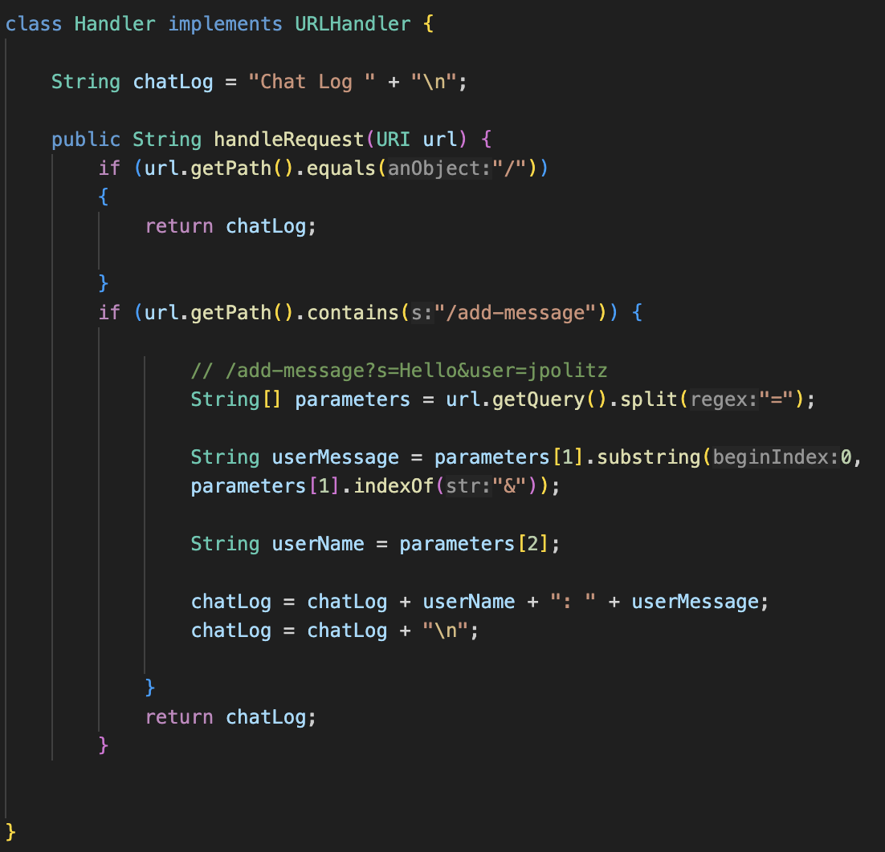
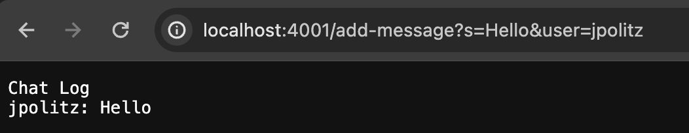
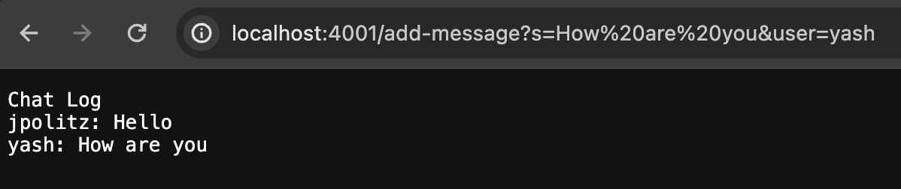
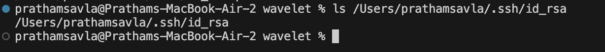
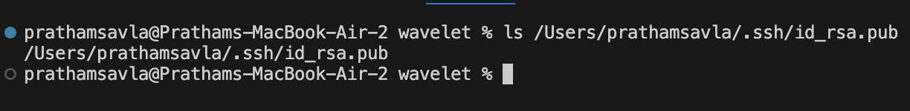
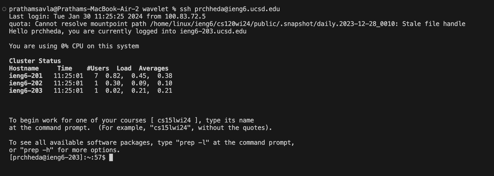

# Lab Report 2 - Servers and SSH Keys (Week 3)
## Pratham Savla

Overview: In this lab, I will be going over how I created by own Chat Server using Java. It will be split up into 3 parts. In Part 1, I go over my code for how I made the Chat Server and I will explain the methods, arguments, and resulting output. In Part 2, I go over the paths to my public and private keys for logging onto ieng6.ucsd.edu. There is a way to log on without entering my password everytime. In Part 3, I go over what I learned from the previous two labs.

### Part 1 Code For Chat Server:

**Two Screenshots Of Using Add Message:**

**Methods That Are Called In the Code:** Primarily, when the user first types in `localhost:4001/` the `handleRequest()` method is called which performs different actions depending on the path provided. If a single `/` is present as the path, the program simply outputs the chat log. If   `/add-message` is provided as the path with queries such as `/add-message?s=Hello&user=jpolitz`, then the "Hello" from user "jpolitz" is added to the Chat Log. Helper methods like `.getPath()`, `.contains()`, `.substring()`, `.indexOf()`, `.getQuery()` are all used to assist in extracting the right fields from the query. 

**Arguments To the Methods:** The main argument to `handleRequest()` is a URI object which contains the URL that the user types in. The argument to the `.contains()` method is `/add-message` which is used to check if `add-message` is the correct path provided by the user. 

**How The Values Change:** The main value that changes is the `String chatLog` to reflect the messages added by the users of the program. One of the main issues I was having with my code is that I declared the String variable `chatLog` inside of the `handleRequest()` method which caused `chatLog` to never update with a new message each time `/add-message` was called. I now understand that `chatLog` has to be declared outside of the `handleRequest()` method. Each time `handleRequest()` is called, the `String[] parameters` array changes to reflect the new queries.

**Methods That Are Called In the Code:** Similar to the first screenshot, when the user types in `localhost:4001/add-message?s=How are you&user=yash`, the `handleRequest()` method is called with the URL as the argument. The `getPath()` method extracts the path from the URL and the `.contains()` method checks to see if the path `/add-message` is provided. Then, the `.split()` and `.getQuery()` methods split up the query to extract the userMessage and userName with the help of `substring()` and `indexOf()`.

**Arguments To the Methods:** Simiarly to the first example, the argument to `handleRequest()` is the URL, `.getPath()` takes in the URL as an argument, `.contains()` takes in the path as an argument, `.getQuery()` takes in the URL as an argument and `.split` takes in the query as an argument.

**How The Values Change:** The main value that changes again is the `String chatLog` variable to reflect the new messages added by the user. The value of String[] parameters changes each time to reflect new queries. 

### Part 2:

**Absolute path to my private key for logging into ieng6:**

**Absolute path to my public key for logging into ieng6:**

**Logging into my ieng6 server without being asked for password:**

### Part 3:
There were many new things that I learned in both the labs from week 2 and week 3. I'm beginning to understand and wrap my head around the idea of a web server a lot more. This was one of the first times in my life using commands like `ssh` to access a web server or commands like `scp` for securely transferring files onto a web server. The whole idea of making a ChatServer was mind-blowing because we had essentially created a web-based application for the first time in class. We could technically acess other people's ChatServers if they were running on ieng6.ucsd.edu.

