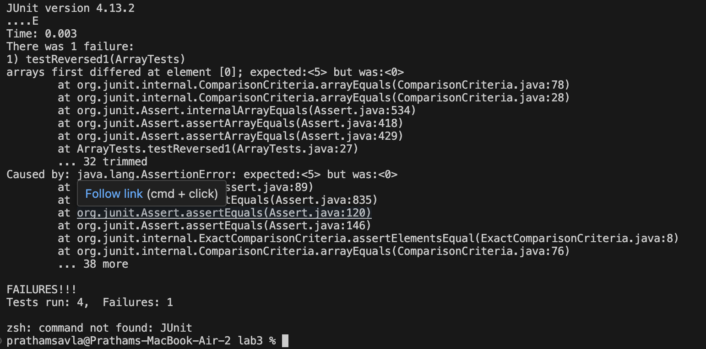
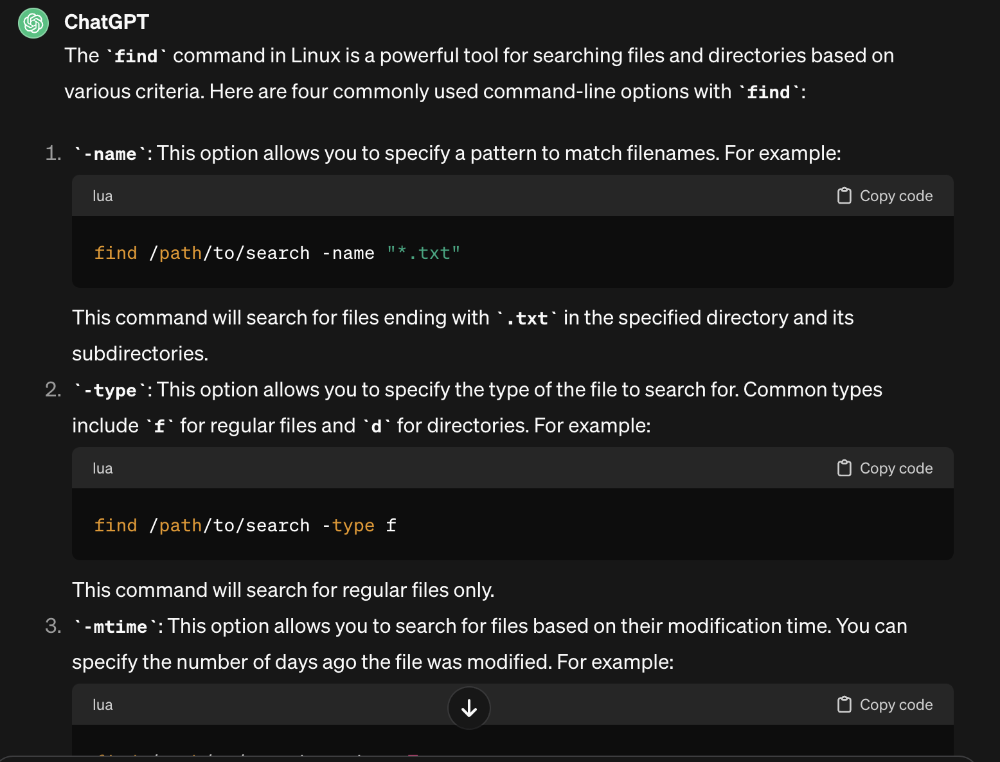
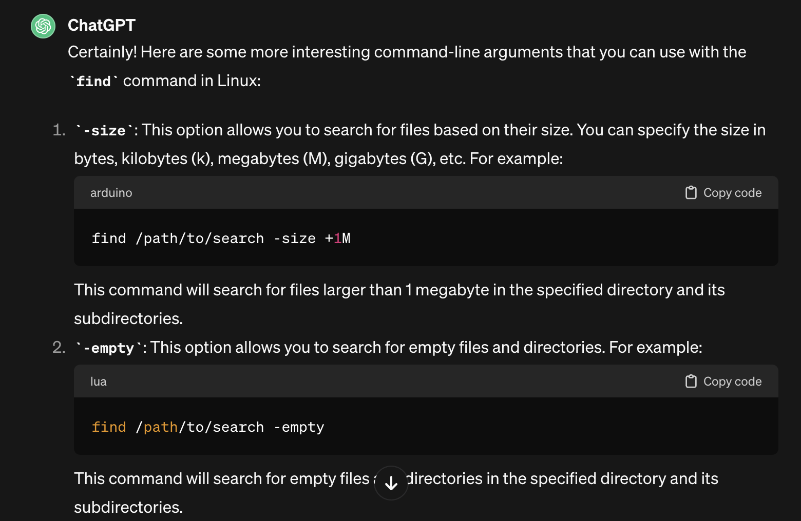
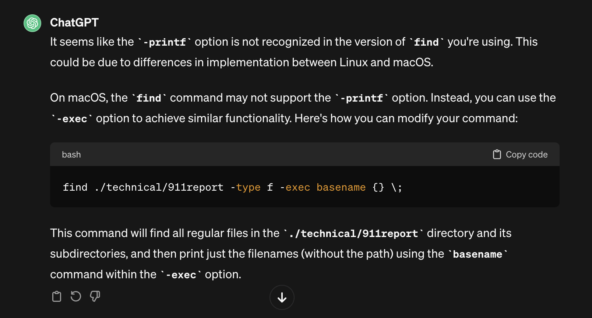

# Lab Report 3 - Bugs and Commands (Week 5)
## Pratham Savla

The bug I will be choosing from week 4's lab is in the ArrayExamples class and specifically the reversed method.
This is the original code with the bug:
```
static int[] reversed(int[] arr) {
    int[] newArray = new int[arr.length];
    for(int i = 0; i < arr.length; i += 1) {
      arr[i] = newArray[arr.length - i - 1];
    }
    return arr;
  }
```
Here is a failure inducing input for the method:
```
@Test
  public void testReversed1() {
    int[] input1 = {1,2,3,4,5};
    assertArrayEquals(new int[]{5,4,3,2,1},ArrayExamples.reversed(input1));
    }
```
Here is an input that does not induce a failure:
```
@Test
  public void testReversed() {
    int[] input1 = { };
    assertArrayEquals(new int[]{ }, ArrayExamples.reversed(input1));
    
  }
```
Here is the JUnit output (Symptom) of the failure-inducing test:


The before code was shown earlier. Here is the after code that fixes the bug:
```
  static int[] reversed(int[] arr) {
    int[] newArray = new int[arr.length];
    for(int i = 0; i < arr.length; i += 1) {
      newArray[i] = arr[arr.length - i - 1];
    }
    return newArray;
  }
```
## Explanation of the Bug: 
The main issue behind the `reversed()` method was that although `newArray` was being initialized, the wrong assignment operation was being done. The for-loop in the original code was assigning each value of `arr[i]`, the original array, with the reverse values of `newArray` instead of the other way around. Also, the wrong array was being returned. `newArray` should be initialized and assigned the reverse values of `arr`, and then finally, `newArray` should be returned. 

# Part 2 - Researching Commands
The command I will be choosing to research is the `find` command. In the interest of full transparency, my research came from using ChatGPT. Here is the prompt I gave ChatGPT:


Here is the resulting output of ChatGPT:




I was getting an error message with the 4th example so I asked ChatGPT this:


And this was the resulting output that led me to fix my 4th example with -exec:



It turns out -printf does not work quite well on MacOS.


**Below you will find examples of how I applied this to my own code:**

1) The first interesting command line argument to use with file is -mtime which allows you to search for files based on their modification time.
   Here is the general scafollding: `find /path/to/search -mtime -7`. Will search for files modified within the last 7 days.

I went ahead and modified one of the files in technical to get some output.
   ```
   Prathams-MacBook-Air-2:docsearch prathamsavla$ find ./technical/biomed -mtime -1
    ./technical/biomed/1468-6708-3-1.txt
    Prathams-MacBook-Air-2:docsearch prathamsavla$ 
   ```
The above command finds all the files in ./technical/biomed that have been modified within the past 24 hours. 
Example #2
```
Prathams-MacBook-Air-2:docsearch prathamsavla$ find ./technical/911report -mtime -1
./technical/911report/chapter-2.txt
./technical/911report/chapter-1.txt
Prathams-MacBook-Air-2:docsearch prathamsavla$
```
When setting up this example, I modified chapter 1 and chapter 2 so I could produce some output.

2) The next interesting command line argument to use with file is -size which allows you to search for files based on their size. Here is the general scaffolding for that: `find /path/to/search -size +1M` You can search with gigabytes, megabytes, etc.

```
   Prathams-MacBook-Air-2:docsearch prathamsavla$ find ./technical/biomed -size +75k
    ./technical/biomed/1472-6904-2-5.txt
    ./technical/biomed/gb-2002-3-12-research0086.txt
    ./technical/biomed/gb-2002-3-12-research0083.txt
    ./technical/biomed/1476-511X-1-2.txt
    ./technical/biomed/1471-2105-3-18.txt
    ./technical/biomed/1472-6882-1-10.txt
    ./technical/biomed/1471-2105-3-2.txt
    Prathams-MacBook-Air-2:docsearch prathamsavla$ 
```
This searches for all files in ./technical/biomed that are greater than 75 kilobytes.

```
Prathams-MacBook-Air-2:docsearch prathamsavla$ find ./technical/911report  -size +1G
Prathams-MacBook-Air-2:docsearch prathamsavla$
```
There were no files greater than 1GB in ./technical/911report. 

3) Using find with -empty allows you to search for empty files and directories.
   I went ahead and made an empty file for the purposes of this demonstration and an empty directory as well.
```
   Prathams-MacBook-Air-2:docsearch prathamsavla$ find ./technical/biomed -empty
    ./technical/biomed/empty.txt
    Prathams-MacBook-Air-2:docsearch prathamsavla$ 
```
Empty Directory:
```
Prathams-MacBook-Air-2:docsearch prathamsavla$ find ./technical/911report -empty
./technical/911report/empty-directory
Prathams-MacBook-Air-2:docsearch prathamsavla$
```
4) Using find with -exec and basename allows you to just print the name of the files and not the paths. Here is the general scaffolding for the command: `find ./pathToFind -type f -exec basename {} \;` Here are two examples:
 ```
   Prathams-MacBook-Air-2:docsearch prathamsavla$ find ./technical/911report -type f -exec basename {} \;
    chapter-13.4.txt
    chapter-13.5.txt
    chapter-13.1.txt
    chapter-13.2.txt
    chapter-13.3.txt
    chapter-3.txt
    chapter-2.txt
    chapter-1.txt
    chapter-5.txt
    chapter-6.txt
    chapter-7.txt
    chapter-9.txt
    chapter-8.txt
    preface.txt
    chapter-12.txt
    chapter-10.txt
    chapter-11.txt
    Prathams-MacBook-Air-2:docsearch prathamsavla$ 
```
This lists all the files in 911 report without the path name.
```
Prathams-MacBook-Air-2:docsearch prathamsavla$ find ./technical/plos -type f -exec basename {} \;
pmed.0020273.txt
journal.pbio.0030032.txt
pmed.0020065.txt
pmed.0020071.txt
pmed.0020059.txt
pmed.0010039.txt
journal.pbio.0020354.txt
pmed.0010010.txt
journal.pbio.0020156.txt
pmed.0020104.txt
pmed.0020272.txt
pmed.0020258.txt
pmed.0020099.txt
journal.pbio.0020140.txt
journal.pbio.0020183.txt
journal.pbio.0020430.txt
journal.pbio.0020394.txt
journal.pbio.0020431.txt
journal.pbio.0020419.txt
pmed.0010013.txt
pmed.0020113.txt
journal.pbio.0020169.txt
pmed.0020098.txt
journal.pbio.0020035.txt
...
```
There was more terminal output but I shortened it for style reasons. The above command lists all the files in ./technical/plos.

   
   


