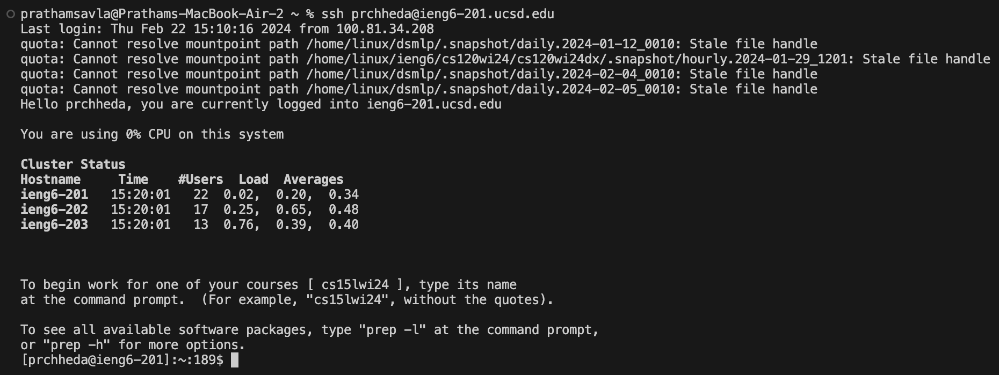
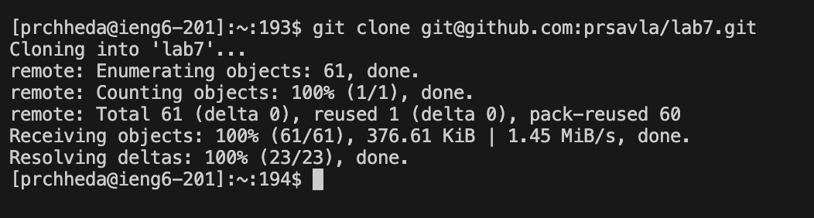
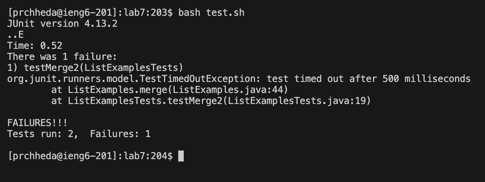
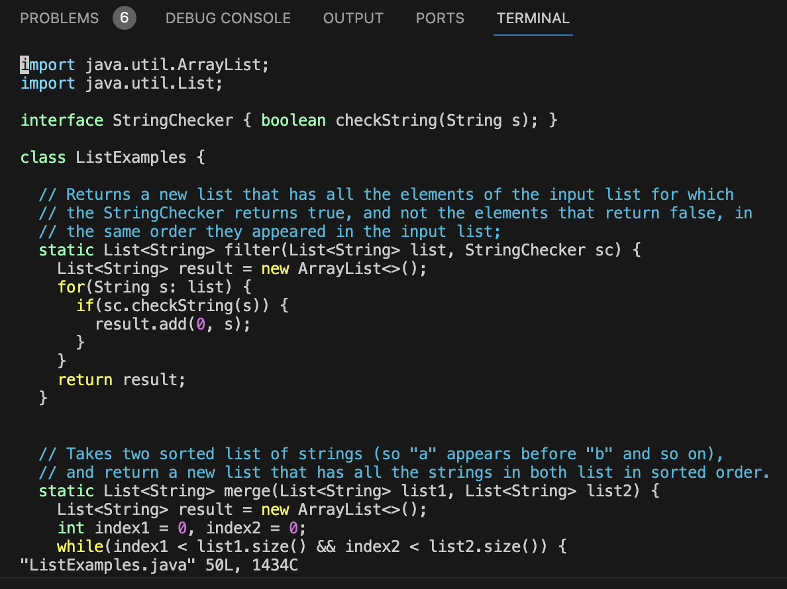
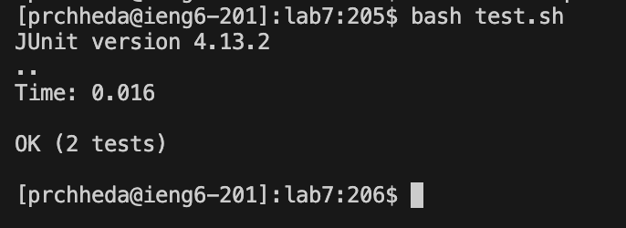
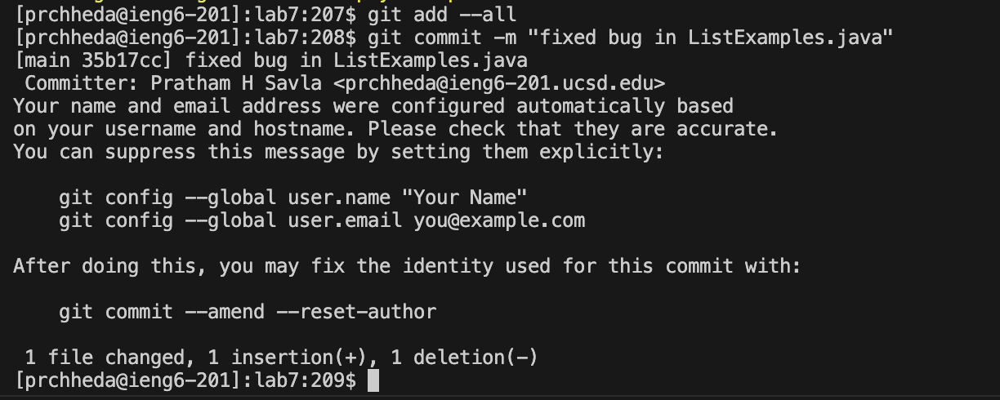
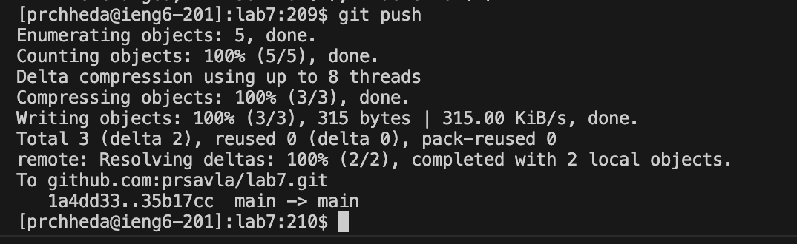

# Lab Report 4 - Doing it All from the Command Line  (Week 7)
## Pratham Savla

### Replicate Steps 4 - 9
Overview: In this lab report, I will be replicating Steps 4-9 of the Week 7 Lab. Provided are the commands, my keystrokes, and the explanations for each of the commands. 

Step 4:
```
ssh prchheda@ieng6-201.ucsd.edu
```
The reason I used `-201` is because I was initially having trouble with the `-203` server and the TA's recommended switching over.



Step 5:
I found the Github SSH url from the fork of my repository
`git clone git@github.com:prsavla/lab7.git` then `<enter>`
 

Step 6:
First, change working directory to `/home/lab7` which can be accomplished by typing 
`cd lab7` and then `<enter>`. 
Next, type:
`bash test.sh` then `<enter>`



Step 7:
`vim ListExamples.java` then `<enter>` 
Here's an image of what entering vim looks like:


Here is the exact pattern of keystrokes I typed after executing `vim ListExamples.java` and then `<enter>`:

**1) `43J` ,
2) Then  `E`,
3) Then  `R`,
4) Then `2` ,
5) Then `:wq`
6) Then `<enter>`**
   
**Let me explain how these steps work to fix the bug in ListExamples.**
1) `43J` will move the cursor down to the 43rd line where the bug exists.
   The 43rd line is `   index1 += 1;`
3) `E` will go to the end of the word so the cursor will be on the `1` in `index1`.
4) `R` will go into replace and when followed with `2` it will replace `1` with `2`.
5) `:wq` will save and quite the file. 

Step 8: Rerun the tests to see if they passes
`bash test.sh` then `<enter>` 


Step 9: Commit and Push the Resulting Change to My Github Account
- Type `git add --all` then `<enter>` 
- Type `git commit -m "fixed bug in ListExamples.java`then `<enter>` 
- Type`git push` then `<enter>`




Here's an explanation for these commands:
1) `git add --all` adds all of the edits and new files to the current commit
2) `git commit -m "fixed bug...` commits the changes that you made to your local repository with a required commit message
3) `git push` syncs your local repository with github. 


