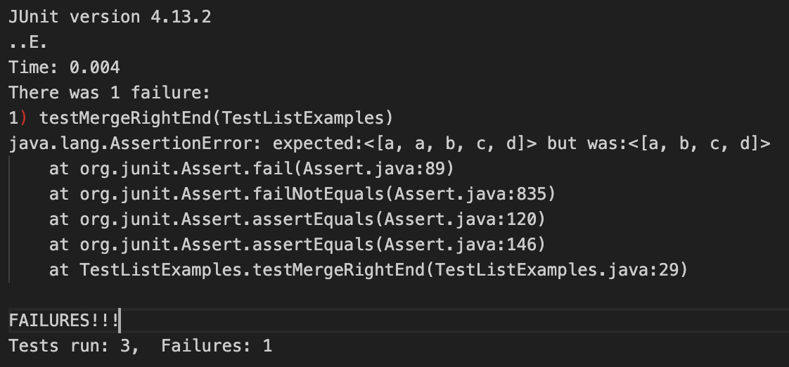
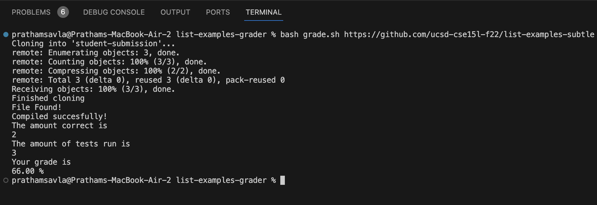
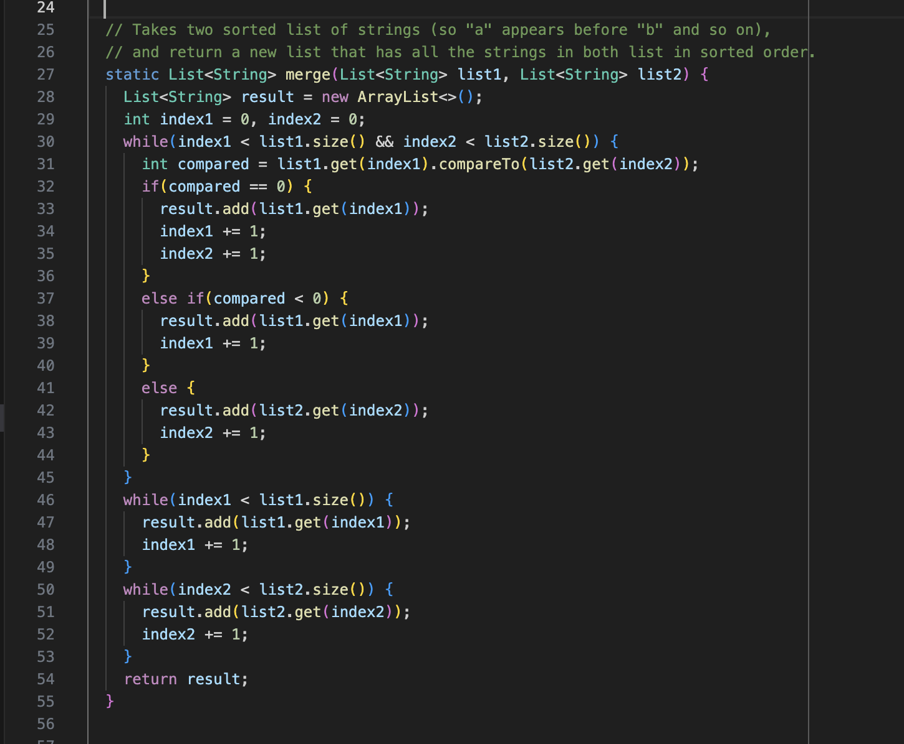
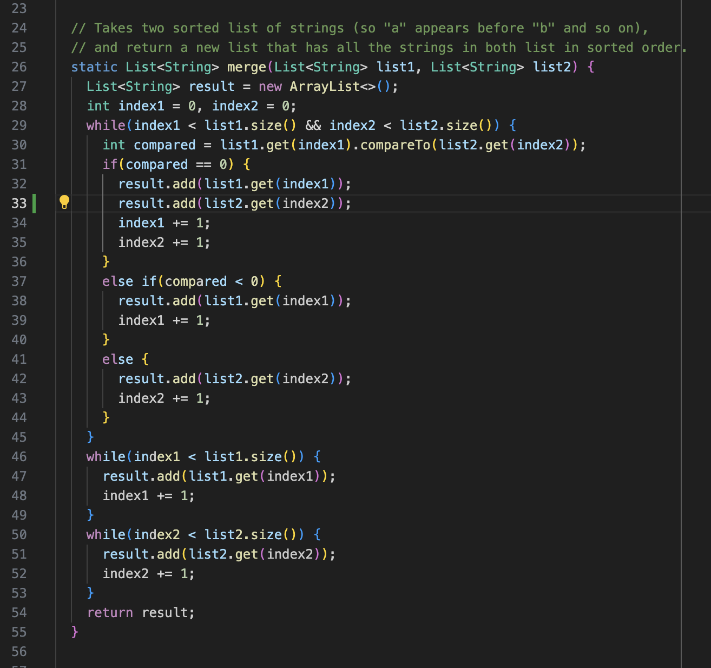
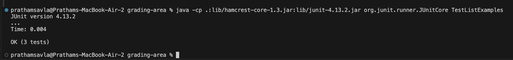

# Lab Report 5 - Putting it All Together (Week 9) 
## Pratham Savla | March 7th 2024 

## Part 1: Debugging Scenario:
Example Conversation on Ed-Stem |

**Beto Ansame (Student):** I keep failing my test for ListExamples.java for the merge() method. It says "expected:<[a, a, b, c, d]> but was:<[a, b, c, d]>. Here is a screenshot of the JUnit output for the test. My guess is that there is some issue with duplicate values when you enter "a,a" twice but I'm not sure. Can you help me fix it? 

**Professional TA:** When running our autograder on your code, this is the resulting output (See screenshow below). It seems that you have failed one of our tests resulting in you grade of 2/3 or 66% . Could you please provide a screenshot of your merge() method inside of your ListExamples.java file so that I can help you better? 

**Beto Ansame:** Here is a screenshot of the merge() method. 

**Professional TA:** It seems that there is an issue with your merge() method where you handle duplicates. Try and trace through the code, what happens when the `if (compared == 0)` executes? Look at specifically Lines 32-35. Are the correct duplicate values being appended to the result list?

**Beto Ansame:** OHH! I understand. Since there's two duplicate values, I only appended one of them from `list1` and I forgot to append the other duplicate value from `list2`. I have fixed the error and attached a screenshot of the fixed version below, could you run the autograder again on my code?

**Professinal TA:** Yep, that's the bug, you fixed it! I have run the Autograder on your code and it passes 100%. Here is the resulting output. 

## Part 2: Reflection 
- A really interesting thing that I learned from the second half of this quarter in the labs was Vim! At first when I was learning Vim in the class lectures, I thought it was pretty useless since we have Graphical User Interfaces now that can basically accomplish what Vim does. However, I learned that many of the servers used by big companies lack GUI's and so people still have to know Vim these days. Overtime, Vim grew on me and I realize now that if you master it, it is actually faster than a normal GUI. The Lab from Week 7 was really interesting because one of my groupmates and I kept finding Vim tricks to minmize the total number of keystrokes. 
